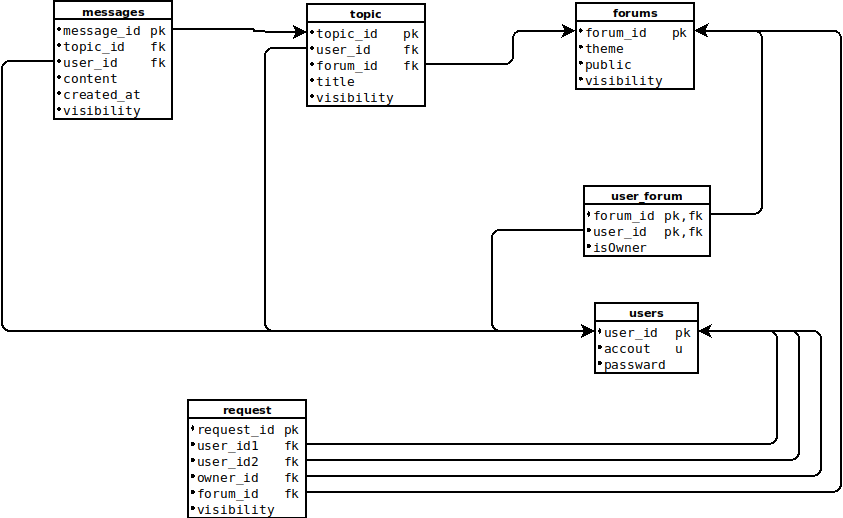

# Keskustelusovellus  
Sovelluksessa näkyy keskustelualueita, joista jokaisella on tietty aihe. Alueilla on keskusteluketjuja, jotka muodostuvat viesteistä. Peruskäyttäjä voi luoda "private" tai "public" alueen, jonka luodessaan hänestä tulee alueen admin. Peruskäyttäjä, joka kuuluu alueseen, voi muodostaa pyynnön alueen adminille lisätäkseen toisen peruskäyttäjä alueseen. Admin käyttäjän tulee vahvistaa pyyntö etusivun kautta.
* Hierarkkiat:
 * Alue = Forum
 * Ketju = Topic
 * Viesti = Message

## Sovelluksen ominaisuuksia:
Viesti max 300 char
Alueen ja ketjun otsikot max 70 char
### Etusivulla
* Luoda uuden tunnuksen :heavy_check_mark:
* Kirjauduu tunnuksella sisään. Kirjaudu ulos ✔️
* Näkee  listalla "public" ja hänen osallistuman "private" alueen otsikot, ketjujen ja viestien määrä ja viimeksi lähetetyn viestin ajankohta. :heavy_check_mark:
* Alueen otsikon kautta pääse kyseiselle alueelle ✔️
* "Create forum"  
  * Voi luoda uuden private/public alueen antamalla alueen otsikko. ✔️
* "Search messages" 
  * Voi etsiä kaikki viestit, joiden osa on sama kuin avainsana. ✔️
  * Näytetään kaikki "Public" alueeseen liittyvät viestit + kaikki käyttäjä osallistuman "Private" alueen viestit ✔️
  * Navigointi suoraan alueeseen ✔️
* "Show requests" 
  * Tämä painike näkyy, jos käyttäjä on jonkun alueen admin :heavy_check_mark:
  * Aluekohtainen admin käyttäjä voi vahvistaa tai hylkää pyyntöä ✔️
  * Pyyntö on muodossa: "User1" want add "User2" to private "Forum". ✔️
  * Navigointi suoraan alueeseen ✔️
### Alueella
* Näkee  listalla "Title", viestien määrä ja aika, jolloin viestiä lähetetiin viimeksi✔️️
* Ketjun otsikon kautta pääse kyseiselle ketjulle ✔️
* Pääsee etusivulle takaisin. ✔️
* "Create topic"
  * Voi luoda uuden ketjun antamalla ketjun otsikko ja aloitusviestin sisällön. Alueen luoja on admin ✔️
* "Edit theme"
  * Vain alueen luojalle ja adminille näytetään tätä painiketta ✔️
  * Vain alueen luoja ja admin pääsevät muokkamaan alueen otsikkoa ✔️
* "Remove forum"
  * Vain admin pääsee poistamaan alueen ✔️
    * Alueen poisto ✔️
    * Ketjun poisto ✔️
    * Viestin poisto ✔️
    * Pyynnön poisto ✔️
* "Show users"
  * Näytä kaikki alueen osallistujat ✔️
  * Admin voi poistaa alueen osallistuja ✔️
  * Admin pääsee "Invite user" sivulle ✔️
* "Invite user"
  * Muodostaa "Request" viestin alueen adminille.✔️
  * "Users not in forum"
### Ketjulla
* Näkee  listalla "Message id","User id", "Content, "Sent at ✔️
* Pääsee alueelle takaisin ✔️
* Viestin kirjoittaja ja admin pääsee muokkamaan viestiä ✔️
* Admin ja viestin kirjoittaja pääsee poistamaan viestin ✔️
* "Create Message"
  * Voi kirjoittaa uuden viestin ketjulle ✔️
* "Edit topic"
  * Vain ketjun luojalle ja Adminille näytetään tätä painiketta ✔️
  * Vain ketjun luoja ja admin pääsee muokkamaan ketjun ostikkoa ✔️
* "Remove topic"
  * Vain ketjun luojalle ja Adminille näytetään tätä painiketta ✔️
  * Vain ketjun luoja ja admin pääsee poistamaan alueen ✔️

<!-- ### Sovelluksen jatkokehitykset
* Näyttää datat "Dialog box":ssa
* Kuvien tallentaminen
* käyttäjä tietojen tallentaminen -->
***
## Käyttäminen
WebChatting voi testata [herokussa](https://web-chatting-app.herokuapp.com/)
## Tietokanta

## Ulkoasu
Sovelluksen ulkoasu toteutetiin manuaalisesti ilman kirjastoa.
